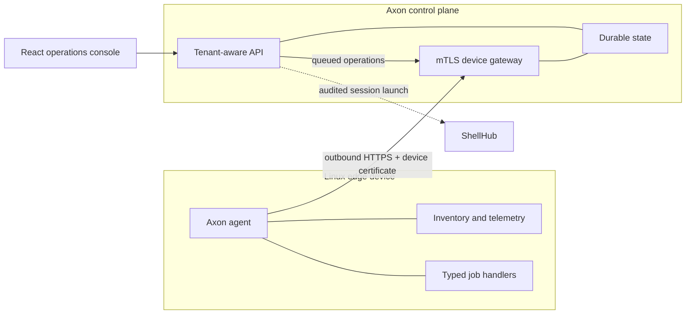

<div align="center">
  
  <h1>Axon</h1>
  <p><strong>Open edge-fleet operations for Linux devices, gateways, and the software they run.</strong></p>
</div>

Axon joins a lightweight Linux agent with a tenant-aware control plane and a
focused operations console. It is designed for Raspberry Pi, Yocto devices,
industrial gateways, and general embedded Linux fleets without binding the
operator workflow to Windows, Linux, or macOS.

> Axon is an implemented MVP foundation. It is suitable for evaluation and
> continued product engineering, but it is not yet a claim of audited,
> production-certified fleet infrastructure.

## What Works Today

| Area | Capabilities |
| --- | --- |
| Fleet visibility | Real enrollment, device presence, hardware/OS inventory, telemetry, downstream gateways, and actual device locations |
| Operations | Typed jobs, offline delivery queue, diagnostics, bounded log collection, and ShellHub launch integration |
| Updates | Signed OS release plans, canary-first Flatpak updates, exact OSTree commit pinning, and self-hosted `.flatpakrepo` descriptors |
| Software posture | Installed Debian/RPM package inventory and optional Trivy-backed OS vulnerability advisory scans |
| Governance | Tenant isolation, built-in RBAC, team-user creation, server-side sessions, and append-oriented audit activity |
| Platform | One Docker Compose command, PostgreSQL, MinIO, Mailpit, local durable state, backup/restore profiles, Helm and Terraform foundations |

Axon does not generate demo fleet data. Empty screens remain empty until a real
agent reports data.

## Architecture



The agent initiates every control-plane connection. Device private keys are
created locally and never uploaded. Jobs are allowlisted, validated, scoped,
time-limited, and persisted for idempotency; arbitrary remote shell commands are
not part of the agent protocol.

## Run The Platform

The only host requirement is Docker Desktop or Docker Engine with Docker
Compose. From the repository root:

```bash
docker compose -f cloud-infra/compose.yaml up --build -d
```

Open [http://localhost:3080](http://localhost:3080) and use the local seed
account:

```text
Email:    admin@example.local
Password: change-me-local
```

Compose starts the console, API/device gateway, PostgreSQL, MinIO, and Mailpit.
It creates only the administrator and organization. Stop it with:

```bash
docker compose -f cloud-infra/compose.yaml down
```

See [local platform setup](./cloud-infra/docs/RUNNING_LOCALLY.md) for addresses,
physical-device networking, logs, backup, and restore.

## Connect A Raspberry Pi

Build an ARM64 installation bundle on any Docker host:

```bash
docker build --target raspberry-pi --output type=local,dest=agent/dist/raspberry-pi agent
```

On the device, use `/opt/unified-fleet-agent` as the temporary project staging
directory. Installed runtime paths are:

```text
/usr/bin/edge-agent
/usr/bin/edge-agentctl
/etc/edge-agent/config.yaml
/etc/edge-agent/ca.pem
/var/lib/edge-agent
```

Generate a token and download the development CA from **Enrollment**, then use
the exact command shape below. Flags after `enroll` belong to that subcommand:

```bash
sudo edge-agentctl -config /etc/edge-agent/config.yaml enroll -token YOUR_TOKEN -name raspberry-pi
sudo systemctl daemon-reload
sudo systemctl enable --now edge-agent
sudo journalctl -u edge-agent -f
```

The service runs in the system service context and does not create or require a
dedicated Linux account. Follow the complete
[Raspberry Pi installation guide](./agent/docs/INSTALLATION.md) or the
[Yocto/i.MX8MP guide](./agent/docs/RUNNING_ON_YOCTO_IMX8MP.md).

## Self-Hosted Flatpak Updates

An update campaign can either use a system remote already configured on the
device or accept your own HTTPS `.flatpakrepo` descriptor URL. When a descriptor
is supplied, the agent adds it as a system remote before validating the
application reference and optional pinned commit. GPG verification remains
enabled; Axon does not use `--no-gpg-verify`.

Example campaign inputs:

```text
Remote name: factory
Repository descriptor: https://updates.example.com/factory.flatpakrepo
Application reference: com.example.Kiosk
OSTree commit: optional 64-character commit
```

Rollouts begin with the configured canary group and require promotion before
the remaining devices are queued.

## Package And CVE Posture

Agents report installed Debian or RPM packages as inventory. If
[Trivy](https://www.trivy.dev/docs/latest/getting-started/installation/) is
installed on a device, it also reports `security:trivy`; an operator can then
queue an OS-package advisory scan from **Applications**.

Axon shows the scanner, scan time, advisory severity, affected package,
installed version, and available fixed version. These are advisory matches, not
an automatic declaration that a device is exploitable or unsuitable for
production. Operators should consider package use and exposure before acting.

## Repository Layout

```text
agent/          Go edge agent, CLI, packaging, Yocto material, and device docs
cloud-infra/    Go control plane, React console, Compose, Helm, Terraform, docs
```

Useful deeper documentation:

- [Cloud architecture](./cloud-infra/docs/ARCHITECTURE.md)
- [Agent architecture](./agent/docs/ARCHITECTURE.md)
- [Agent threat model](./agent/docs/THREAT_MODEL.md)
- [ShellHub integration](./cloud-infra/docs/SHELLHUB_INTEGRATION.md)
- [Cloud implementation status](./cloud-infra/docs/IMPLEMENTATION_STATUS.md)
- [Agent implementation status](./agent/docs/IMPLEMENTATION_STATUS.md)

## Development Checks

```bash
docker build --target test agent
docker build -f cloud-infra/deploy/compose/service.Dockerfile --target test cloud-infra
docker compose -f cloud-infra/compose.yaml config
```

The React production build is executed by the web image build. Keep secrets,
private keys, generated device identity, data volumes, and vulnerability reports
out of source control.

## Product Direction

The strongest next investments are production PostgreSQL/S3 adapters, signed
artifact upload and provenance, phased OS-adapter execution, SSO/MFA, alert
routing, policy-as-code, software bill-of-material ingestion, and an audited
ShellHub deployment profile. The implemented/deferred matrices remain the source
of truth while those areas evolve.

## License

The agent and cloud components contain their respective license files. Review
them before redistribution or commercial deployment.
