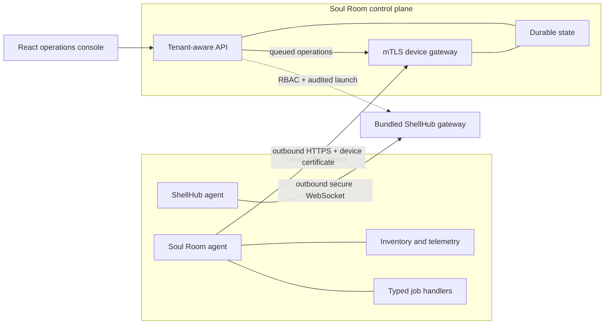

<div align="center">
  
  <h1>Soul Room</h1>
  <p><strong>Open edge-fleet operations for Linux devices, gateways, and the software they run.</strong></p>
</div>

Soul Room joins a lightweight Linux agent with a tenant-aware control plane and a
focused operations console. It is designed for Yocto devices, industrial
gateways, single-board computers, and general embedded Linux fleets without binding the
operator workflow to Windows, Linux, or macOS.

> Soul Room is an implemented MVP foundation. It is suitable for evaluation and
> continued product engineering, but it is not yet a claim of audited,
> production-certified fleet infrastructure.

## What Works Today

| Area | Capabilities |
| --- | --- |
| Fleet visibility | Real enrollment, device presence, hardware/OS inventory, telemetry, downstream gateways, and actual device locations |
| Operations | Typed jobs, offline delivery queue, diagnostics, bounded log collection, and bundled self-hosted ShellHub remote access |
| Updates | Signed OS release plans for arm64/aarch64 and armv7, pilot-first Flatpak updates, exact OSTree commit pinning, and self-hosted `.flatpakrepo` descriptors |
| Software posture | Installed Debian/RPM package inventory and optional Trivy-backed OS vulnerability advisory scans |
| Governance | Tenant isolation, built-in RBAC, team-user creation, server-side sessions, and append-oriented audit activity |
| Platform | One Docker Compose command, PostgreSQL, MinIO, Mailpit, local durable state, backup/restore profiles, Helm and Terraform foundations |

Soul Room does not generate demo fleet data. Empty screens remain empty until a real
agent reports data.

## Architecture



The agent initiates every control-plane connection. Device private keys are
created locally and never uploaded. Jobs are allowlisted, validated, scoped,
time-limited, and persisted for idempotency; arbitrary remote shell commands are
not part of the agent protocol.

## Run The Platform

The only host requirement is Docker Desktop or Docker Engine with Docker
Compose. Copy `cloud-infra/.env.example` to `cloud-infra/.env`, then set your
company identity and initial owner account:

```dotenv
SOULROOM_ORGANIZATION_NAME=Acme Devices
SOULROOM_ORGANIZATION_SLUG=acme-devices
SOULROOM_ADMIN_EMAIL=admin@acme.com
SOULROOM_ADMIN_PASSWORD=replace-with-a-long-unique-password
```

From the repository root:

```bash
docker compose -f cloud-infra/compose.yaml up --build -d
```

Open [http://localhost:3080](http://localhost:3080) and sign in with the owner
account configured in `cloud-infra/.env`.

Compose starts the console, API/device gateway, PostgreSQL, MinIO, Mailpit, and
the pinned ShellHub Community Edition services. ShellHub is available at
[http://localhost:8088](http://localhost:8088); complete its setup wizard once
before adding remote-access devices. Its SSH gateway listens on port `22222`.
It creates only the configured administrator and organization. Bootstrap
credentials are applied only to a clean installation and are not reapplied on
normal restarts. Stop it with:

```bash
docker compose -f cloud-infra/compose.yaml down
```

See [local platform setup](./cloud-infra/docs/RUNNING_LOCALLY.md) for addresses,
physical-device networking, logs, backup, and restore.

## Connect An Embedded Linux Device

Build the installation bundle that matches the device on any Docker host:

```bash
# 64-bit ARM: aarch64 / arm64
docker build --target embedded-linux-arm64 --output type=local,dest=agent/dist/embedded-linux-arm64 agent

# 32-bit ARM: armv7 / armhf
docker build --target embedded-linux-armv7 --output type=local,dest=agent/dist/embedded-linux-armv7 agent
```

On the device, use `/opt/soul-room-agent` as the temporary project staging
directory. Installed runtime paths are:

```text
/usr/bin/edge-agent
/usr/bin/edge-agentctl
/etc/edge-agent/config.yaml
/etc/edge-agent/ca.pem
/var/lib/edge-agent
```

Generate a token and download the development CA from **Enrollment**, then use
the exact command shape below. Flags after `enroll` belong to that subcommand:

```bash
sudo edge-agentctl -config /etc/edge-agent/config.yaml enroll -token YOUR_TOKEN -name embedded-linux-arm64
sudo systemctl daemon-reload
sudo systemctl enable --now edge-agent
sudo journalctl -u edge-agent -f
```

The service runs in the system service context and does not create or require a
dedicated Linux account. Follow the complete
[embedded Linux installation guide](./agent/docs/EMBEDDED_LINUX_INSTALLATION.md) or the
[Yocto/i.MX8MP guide](./agent/docs/RUNNING_ON_YOCTO_IMX8MP.md).

## Remote Access With ShellHub

Soul Room includes a self-hosted ShellHub Community Edition deployment. No
external ShellHub URL is required. On first startup:

1. Open [http://localhost:8088/setup](http://localhost:8088/setup).
2. Create the ShellHub administrator and first namespace.
3. Install the ShellHub agent on the device using the tenant ID shown by that namespace.
4. Accept the pending device in ShellHub and copy its SSHID.
5. In Soul Room, open **Remote access**, select the matching fleet device, and save the SSHID.

The Soul Room agent and ShellHub agent are separate services: the former owns
fleet telemetry, jobs, and OTA; the latter owns the outbound remote-shell
tunnel. Soul Room checks RBAC and writes an audit event before handing the
operator to ShellHub. See the [complete ShellHub guide](./cloud-infra/docs/SHELLHUB_INTEGRATION.md)
for Ubuntu, Yocto, networking, persistence, and production TLS requirements.

## Self-Hosted Flatpak Updates

An update campaign can either use a system remote already configured on the
device or accept your own HTTPS `.flatpakrepo` descriptor URL. When a descriptor
is supplied, the agent adds it as a system remote before validating the
application reference and optional pinned commit. GPG verification remains
enabled; Soul Room does not use `--no-gpg-verify`.

Example campaign inputs:

```text
Remote name: factory
Repository descriptor: https://updates.example.com/factory.flatpakrepo
Application reference: com.example.Kiosk
OSTree commit: optional 64-character commit
```

Rollouts begin with the configured pilot group and require promotion before the
remaining devices are queued. The API field remains `canary_percent` for
protocol compatibility; the console uses the clearer operator term "pilot
group."

## Package And CVE Posture

Agents report installed Debian or RPM packages as inventory. If
[Trivy](https://www.trivy.dev/docs/latest/getting-started/installation/) is
installed on a device, it also reports `security:trivy`; an operator can then
queue an OS-package advisory scan from **Applications**.

Soul Room shows the scanner, scan time, advisory severity, affected package,
installed version, and available fixed version. These are advisory matches, not
an automatic declaration that a device is exploitable or unsuitable for
production. Operators should consider package use and exposure before acting.

## Repository Layout

```text
agent/          Go edge agent, CLI, packaging, Yocto material, and device docs
cloud-infra/    Go control plane, React console, Compose, Helm, Terraform, docs
```

Keep the agent and cloud in this one repository while their enrollment, job,
telemetry, and update contracts evolve together. Each directory has its own
Dockerfile, tests, documentation, and release surface, so it can be split into a
dedicated repository later without changing the code layout. The root README is
the end-to-end entry point; component READMEs remain independently usable.

Useful deeper documentation:

- [Cloud architecture](./cloud-infra/docs/ARCHITECTURE.md)
- [Agent architecture](./agent/docs/ARCHITECTURE.md)
- [Agent threat model](./agent/docs/THREAT_MODEL.md)
- [ShellHub integration](./cloud-infra/docs/SHELLHUB_INTEGRATION.md)
- [Cloud implementation status](./cloud-infra/docs/IMPLEMENTATION_STATUS.md)
- [Agent implementation status](./agent/docs/IMPLEMENTATION_STATUS.md)

## Development Checks

```bash
docker build --target test agent
docker build -f cloud-infra/deploy/compose/service.Dockerfile --target test cloud-infra
docker compose -f cloud-infra/compose.yaml config
```

The React production build is executed by the web image build. Keep secrets,
private keys, generated device identity, data volumes, and vulnerability reports
out of source control.

## Local Data Hygiene

Compose stores device registrations, events, certificates, object data, and
database state in named Docker volumes. Local `.env` files, backups, generated
agent state, certificates, and file-backed control-plane stores are ignored by
Git. A fresh clone starts with only the local administrator and organization;
it contains no devices, telemetry, jobs, or events from another installation.

To intentionally erase a local installation and return to that clean state, run
these commands from the repository root on Windows, Linux, or macOS:

```bash
docker compose -f cloud-infra/compose.yaml down -v
docker compose -f cloud-infra/compose.yaml up --build -d
```

The first command permanently removes this installation's registered devices,
telemetry, jobs, events, certificates, database records, and object data. It does
not delete source files. Use the maintenance backup profile first when the local
fleet data matters.

## Product Direction

The strongest next investments are production PostgreSQL/S3 adapters, signed
artifact upload and provenance, phased OS-adapter execution, SSO/MFA, alert
routing, policy-as-code, software bill-of-material ingestion, and deeper
ShellHub API/identity automation. The implemented/deferred matrices remain the source
of truth while those areas evolve.

## License

The agent and cloud components contain their respective license files. Review
them before redistribution or commercial deployment.
