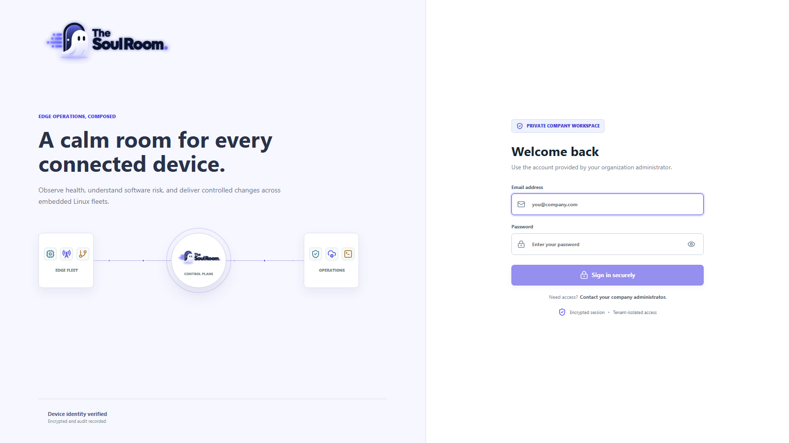
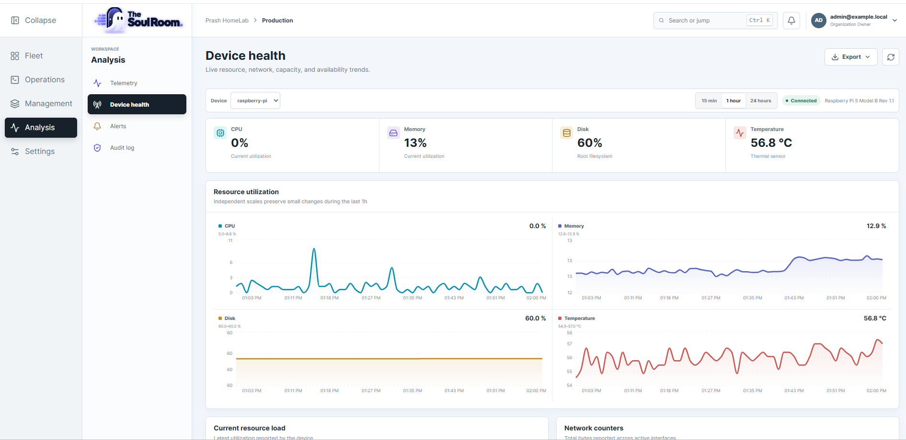
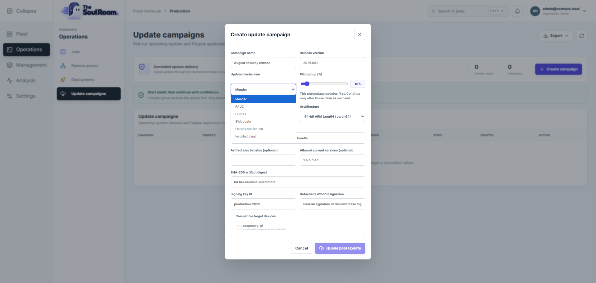

<div align="center">
  
  <p><strong>Manage Linux edge devices, gateways, software, and updates from one place.</strong></p>
</div>

Soul Room combines a lightweight Linux agent, a tenant-aware control plane, and
a React operations console. It is intended for Ubuntu and Debian systems,
Yocto-based products, industrial gateways, single-board computers, and other
embedded Linux devices.

> [!NOTE]
> **Soul Room is currently released as an open-source public beta.** The core
> fleet-management workflows are implemented and suitable for evaluation,
> development labs, and controlled pilot deployments. Before using Soul Room
> for production or safety-critical fleets, independently validate your
> security configuration, tenant isolation, update compatibility, rollback
> strategy, backups, and recovery procedures. Review the current
> [implementation status](./cloud-infra/docs/IMPLEMENTATION_STATUS.md), and
> report reproducible problems through GitHub Issues. Feedback and
> contributions from embedded Linux, Yocto, IoT, security, and platform
> engineering teams are welcome.

## Console Preview

Login page
<p align="center">
  
</p>

Device health view
<p align="center">
  
</p>

Setup OTA campaign
<p align="center">
  
</p>

## Quick Start

### 1. Prepare the installation

Install Docker Desktop, or Docker Engine with Docker Compose v2. No local Go or
Node.js installation is required to run the platform.

For a quick localhost-only evaluation, the environment file is optional. If it
is missing, or it does not define owner credentials, a clean installation uses:

| Field | Local fallback |
| --- | --- |
| Email | <code>admin@soulroom.local</code> |
| Password | <code>change-me-local</code> |

These credentials are intentionally limited to development convenience. Do not
expose the platform to a LAN or the internet with this password.

For a normal installation, create your local configuration from the example:

```bash
# Linux, macOS, or WSL
cp cloud-infra/.env.example cloud-infra/.env
```

```powershell
# Windows PowerShell
Copy-Item -Path .\cloud-infra\.env.example -Destination .\cloud-infra\.env
```

<code>Copy-Item</code> is the PowerShell copy command. The value after
<code>-Path</code> is the supplied template; <code>-Destination</code> is the
new private configuration file. Open <code>cloud-infra/.env</code> and choose
the organization and first owner account:

```dotenv
SOULROOM_ORGANIZATION_NAME=Your Company
SOULROOM_ORGANIZATION_SLUG=your-company
SOULROOM_ADMIN_EMAIL=owner@your-company.com
SOULROOM_ADMIN_PASSWORD=choose-a-unique-password-with-12-or-more-characters
```

For a physical device, also set `SOULROOM_DEVICE_PUBLIC_HOST` to the DNS name
or LAN address that the device can reach. See
[physical-device networking](./cloud-infra/docs/RUNNING_LOCALLY.md#connect-a-physical-device).

### 2. Install and start Soul Room

Pull the published multi-architecture images and start the platform with one
command from the repository root:

```bash
# Linux, macOS, or WSL
./platform.sh install
```

```bat
:: Windows Command Prompt or PowerShell
platform.cmd install
```

Use `./platform.sh build` or `platform.cmd build` instead when you want to
compile the images from the checked-out source.

Open [http://localhost:3080](http://localhost:3080). When another computer is
hosting the stack, replace `localhost` with that computer's DNS name or IP
address.

### 3. Sign in

| Installation | Account to use |
| --- | --- |
| New volume without owner values in `.env` | `admin@soulroom.local` / `change-me-local` |
| New, empty data volume | The exact `SOULROOM_ADMIN_EMAIL` and `SOULROOM_ADMIN_PASSWORD` values set in `cloud-infra/.env` before the first start |
| Existing data volume | The account created when that volume was first initialized |
| Normal rebuild or restart | The existing account; bootstrap values are not applied again |

Changing `.env` later does not change an existing owner's email or password.
This protects installed accounts from being silently overwritten. For a
disposable local environment, the [clean reset](#reset-a-local-installation)
creates a new installation from the current `.env` values.

### 4. Use the launcher

| Command | Purpose |
| --- | --- |
| `./platform.sh install` / `platform.cmd install` | Pull published GHCR images and start the platform |
| `./platform.sh up` / `platform.cmd up` | Start existing images |
| `./platform.sh build` / `platform.cmd build` | Build images and start the platform |
| `./platform.sh refresh` / `platform.cmd refresh` | Rebuild and recreate containers after source changes |
| `./platform.sh down` / `platform.cmd down` | Stop containers and preserve data |
| `./platform.sh status` / `platform.cmd status` | Show container and health status |
| `./platform.sh logs` / `platform.cmd logs` | Follow platform logs |
| `./platform.sh doctor` / `platform.cmd doctor` | Check Docker and validate Compose |

The normal stack starts the Soul Room console and control plane together with a
self-hosted ShellHub deployment. Fleet state is kept in Docker volumes and is
preserved by `down`, `restart`, and `refresh`.

## Connect Your First Device

The same agent runs on supported Ubuntu, Debian, and Yocto-based Linux systems.
The device CPU architecture determines which bundle to build; the distribution
determines only how you integrate the service.

### 1. Create enrollment material

In Soul Room, open **Management > Enrollment**:

1. Generate a one-time enrollment token.
2. Download `soul-room-dev-ca.pem`.
3. Note the device gateway endpoint shown on the page.

### 2. Build the matching agent bundle

Check the target architecture with `uname -m`, then build from the repository
root:

| `uname -m` result | Bundle |
| --- | --- |
| `x86_64` | `embedded-linux-amd64` |
| `aarch64` or `arm64` | `embedded-linux-arm64` |
| `armv7l` or `armv7` | `embedded-linux-armv7` |

Tagged GitHub releases include ready-to-install archives for all three targets
and a `SHA256SUMS` file. Download the matching archive from **Releases** when
you do not need to compile the agent yourself.

```bash
# x86-64
docker build --target embedded-linux-amd64 --output type=local,dest=agent/dist/embedded-linux-amd64 agent

# 64-bit ARM, including Raspberry Pi 64-bit and i.MX8MP
docker build --target embedded-linux-arm64 --output type=local,dest=agent/dist/embedded-linux-arm64 agent

# 32-bit ARMv7
docker build --target embedded-linux-armv7 --output type=local,dest=agent/dist/embedded-linux-armv7 agent
```

Each output directory contains `edge-agent`, `edge-agentctl`, the default
configuration, a systemd unit, and `install.sh`.

Docker is not required to build the agent. With Go 1.27.1 or newer installed on
Linux, you can compile both binaries natively. From another operating system,
cross-compile with <code>GOOS=linux</code> and assemble the same installer
bundle. See
[Build the agent without Docker](./agent/README.md#option-1-build-directly-with-go)
for the exact commands.

### 3. Install and enroll on the device

Copy the matching bundle and downloaded CA to a temporary directory on the
device, such as `/opt/soul-room-agent`, then run:

```bash
sudo sh install.sh \
  --endpoint https://SOUL_ROOM_HOST:8443 \
  --ca ./soul-room-dev-ca.pem \
  --token ONE_TIME_TOKEN \
  --name DEVICE_NAME
```

`SOUL_ROOM_HOST` must be the same reachable DNS name or IP address configured
for the platform. The installer does not create a dedicated Linux user. It
installs the binaries, preserves an existing device identity, enrolls the
device, and starts the systemd service.

### 4. Verify the connection

```bash
sudo edge-agentctl -config /etc/edge-agent/config.yaml status
sudo systemctl status edge-agent
sudo journalctl -u edge-agent -f
```

A connected device appears under **Fleet > Devices** after its first
heartbeat. Inventory and telemetry populate from real device reports; Soul Room
does not create demo devices or synthetic telemetry.

Location reporting is intentionally disabled by default. Use the terminal UI
to select `static`, `gpsd`, or explicitly enabled IP-based location, then
restart the service:

```bash
sudo edge-agentctl -config /etc/edge-agent/config.yaml tui
sudo systemctl restart edge-agent
```

The complete workflow, including native builds and non-systemd image
integration, is in the [embedded Linux installation guide](./agent/docs/EMBEDDED_LINUX_INSTALLATION.md).
For an image-integrated device, continue with the [Yocto guide](./agent/docs/YOCTO_INTEGRATION.md)
or the [i.MX8MP example](./agent/docs/RUNNING_ON_YOCTO_IMX8MP.md).

## What Is Included

| Area | Current capability |
| --- | --- |
| Fleet | Enrollment, presence, hardware and OS inventory, gateways, telemetry, and device locations |
| Operations | Typed jobs, offline delivery, diagnostics, bounded log collection, deployments, and alerts |
| Updates | Capability-gated Mender, RAUC, OSTree, SWUpdate, Flatpak, and custom adapters with pilot-first rollout |
| Remote access | Bundled self-hosted ShellHub with outbound device tunnels and audited launch from Soul Room |
| Software posture | Debian/RPM package inventory and optional Trivy-backed vulnerability advisory scans |
| Administration | Tenant isolation, users and roles, platform settings, audit history, backup, and restore |
| Interface | Responsive React console, fleet search, charts, exports, and MapLibre/OpenStreetMap fleet mapping |

The cloud and agent deliberately reject capabilities a device does not report.
For OTA, installing an updater binary is not enough: the device image must also
provide the updater's signing trust, storage layout, boot integration, health
check, and rollback behavior. Read the [OTA adapter guide](./agent/docs/OTA_ADAPTERS.md)
before creating a production update campaign.

## Remote Access

ShellHub Community Edition is included in Compose; no external ShellHub account
or URL is required. On first use, open **Operations > Remote access**, create the
ShellHub administrator and namespace in the embedded setup screen, then install
the separate ShellHub agent only on devices that permit interactive access.

The Soul Room agent handles fleet inventory, telemetry, jobs, and OTA. The
ShellHub agent handles the remote SSH tunnel. See the [ShellHub guide](./cloud-infra/docs/SHELLHUB_INTEGRATION.md)
for device enrollment, ports, persistence, and production TLS requirements.

## Data And Clean Installs

Local `.env` files, certificates, private keys, backups, generated device
identity, and file-backed platform state are ignored by Git. Docker volumes hold
registered devices, telemetry, jobs, events, certificates, and ShellHub state.
A new clone starts with an empty fleet.

### Reset a local installation

Use this only when all local platform and ShellHub data may be deleted:

```bash
docker compose -f cloud-infra/compose.yaml down -v
docker compose -f cloud-infra/compose.yaml up --build -d
```

The first command permanently removes local accounts, devices, telemetry,
jobs, events, certificates, and ShellHub records. Create a
[backup](./cloud-infra/docs/BACKUP_RESTORE.md) first when the data matters.

## Repository Layout

```text
agent/          Go edge agent, CLI, Linux packaging, Yocto recipes, and device docs
cloud-infra/    Go control plane, React console, Compose, Helm, Terraform, and cloud docs
docs/           Repository-level documentation index and screenshots
platform.sh     Cross-platform launcher for Linux, macOS, and WSL
platform.cmd    Windows launcher
```

Keeping agent and cloud code together makes protocol changes reviewable in one
place. Each component still has its own build, tests, README, and release
surface, so it can be split later if independent release cycles become useful.

## Documentation

Start with the [documentation index](./docs/README.md), or go directly to a
common task:

| Task | Guide |
| --- | --- |
| Run the platform locally | [Local platform guide](./cloud-infra/docs/RUNNING_LOCALLY.md) |
| Configure an on-premises installation | [On-premises administration](./cloud-infra/docs/ONPREM_ADMIN.md) |
| Understand the control plane | [System architecture](./cloud-infra/docs/SYSTEM_ARCHITECTURE.md) |
| Build, deploy, and configure the agent | [Agent guide](./agent/README.md) |
| Review detailed Linux installation | [Embedded Linux installation](./agent/docs/EMBEDDED_LINUX_INSTALLATION.md) |
| Integrate with Yocto | [Yocto integration](./agent/docs/YOCTO_INTEGRATION.md) |
| Configure update mechanisms | [OTA adapters](./agent/docs/OTA_ADAPTERS.md) |
| Configure remote access | [ShellHub integration](./cloud-infra/docs/SHELLHUB_INTEGRATION.md) |
| Diagnose an offline agent | [Agent troubleshooting](./agent/docs/TROUBLESHOOTING.md) |
| Back up or restore data | [Backup and restore](./cloud-infra/docs/BACKUP_RESTORE.md) |
| Review security assumptions | [Cloud threat model](./cloud-infra/docs/THREAT_MODEL.md) and [agent threat model](./agent/docs/THREAT_MODEL.md) |

## Development Checks

```bash
docker build --target test agent
docker build -f cloud-infra/deploy/compose/service.Dockerfile --target test cloud-infra
docker compose -f cloud-infra/compose.yaml config
```

The React production build runs as part of the web image build.

## Automated Builds And Security

Repository-level GitHub Actions run Go and React tests, formatting checks,
cross-compilation, Compose validation, CodeQL analysis, `govulncheck`, npm
audit, and Trivy dependency, secret, configuration, and container-image scans.
Dependabot checks Go, npm, Docker, and GitHub Actions dependencies each week.

Successful changes on `master` publish `linux/amd64` and `linux/arm64` images
with SBOM and provenance attestations to:

- `ghcr.io/prashantdivate/soul-room-platform`
- `ghcr.io/prashantdivate/soul-room-web-ui`
- `ghcr.io/prashantdivate/soul-room-shellhub-keygen`

Tags matching `v*` also create a GitHub Release containing amd64, arm64, and
ARMv7 agent installation bundles with SHA-256 checksums. Release publishing is
blocked when tests or high/critical vulnerability checks fail.

## License

The agent and cloud components contain their own license files. Review both
before redistribution or commercial deployment.
