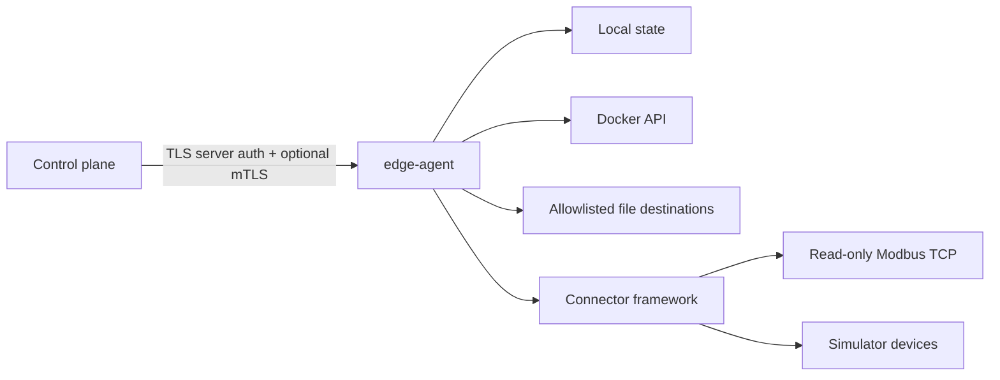
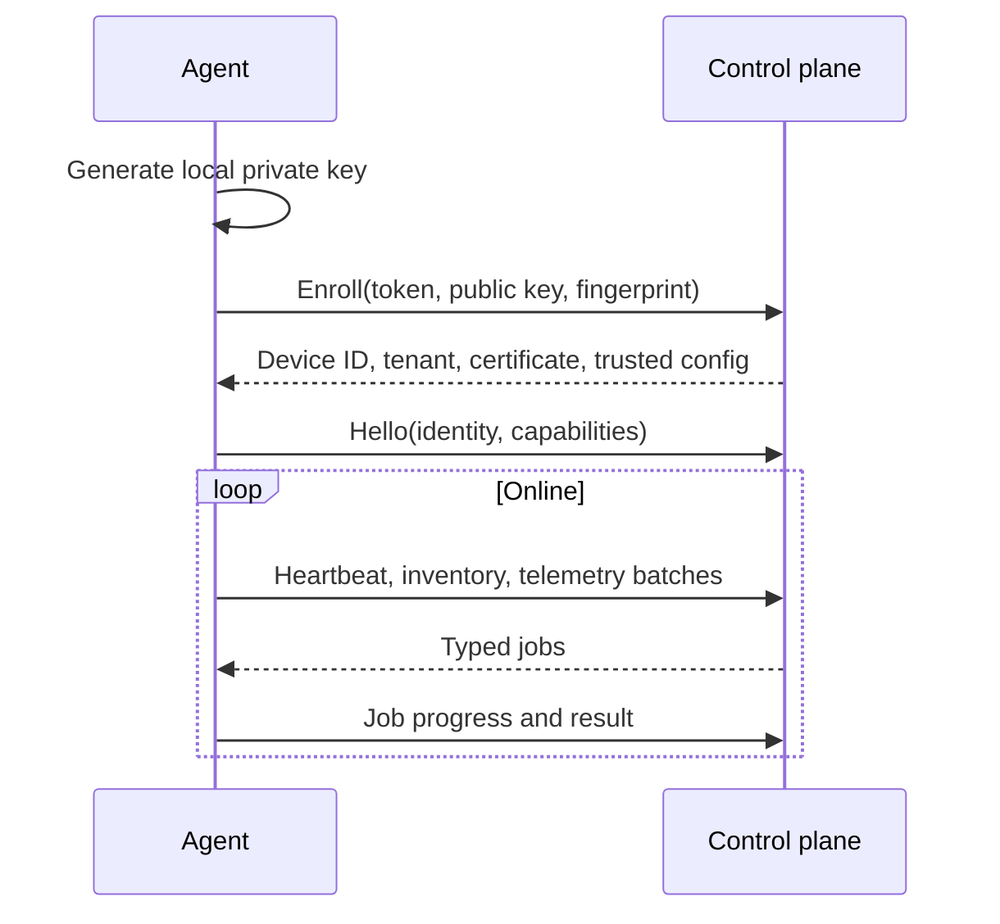

# Architecture

The agent is a single Linux service with narrow internal subsystems:

* `identity`: local key generation, identity persistence, signer abstraction.
* `enrollment`: one-time token enrollment and development local CA support.
* `transport`: outbound HTTPS client, TLS validation, retry and replay metadata.
* `storage`: durable bounded queues and persisted job state.
* `telemetry`: collector scheduler and normalized metrics.
* `inventory`: normalized device and downstream inventory.
* `jobs`: typed job validation, execution, recovery, results, and idempotency.
* `applications`: safe file deployment and application state adapters.
* `containers`: managed container policy and provider abstraction.
* `gateway` and `connectors`: downstream device representation and connectors.
* `ota`: OTA adapter interface and simulator adapter.
* `observability` and `audit`: structured logs, counters, and audit events.

## Trust Boundary

## Connection Lifecycle

