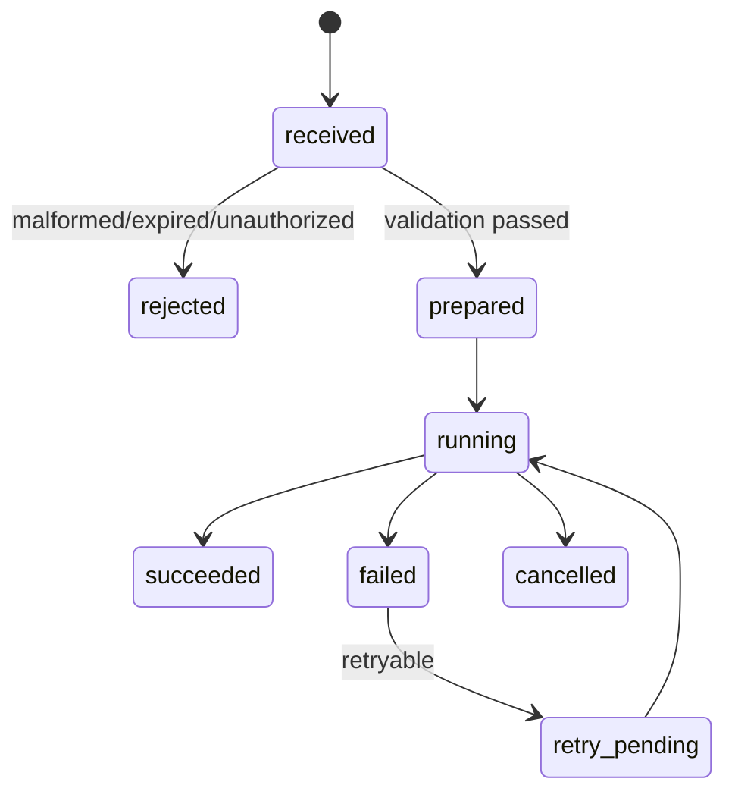

# Job State Machine

Jobs are typed and allowlisted. Each job must include job ID, tenant ID, device
ID, type, expiry, attempt, scopes, payload, and optional payload digest.

Completed successful jobs are persisted and are not silently rerun after
reconnect or restart.
