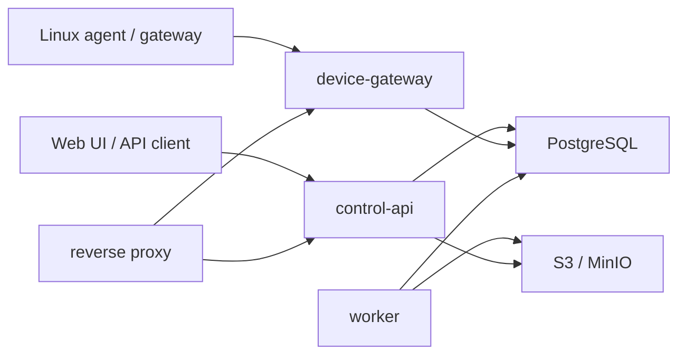

# System Architecture

The MVP is a modular monolith with isolated internal packages. The service can
later split along identity, device communication, telemetry ingestion,
deployment, notification, remote-access broker, and reporting boundaries once
measured scaling needs justify it.

## Request Boundaries

* Browser/API traffic enters `control-api` and is authorized using server-side
  session/API-token context.
* Device traffic enters `device-gateway`, authenticates by enrollment token or
  device certificate identity, and never receives internal database models.
* Workers process durable jobs from PostgreSQL and object storage, not in-memory
  queues.

## Tenant Boundary

Every tenant-owned entity includes `tenant_id`. Repository APIs require an
explicit `tenancy.Context`; handlers derive tenant scope from authenticated
membership rather than browser-submitted tenant IDs.

## Deployment Profiles

* Small on-premises: Docker Compose with PostgreSQL, MinIO, reverse proxy, API,
  gateway, worker, web UI, mock SMTP.
* Scalable production: Helm with external PostgreSQL/S3 support, ingress, TLS,
  probes, resource limits, network policies, and pod disruption budgets.
